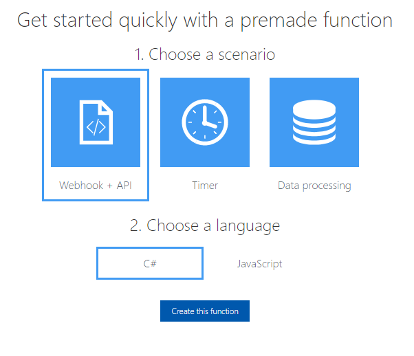

Nationwide Hackathon -- Azure Field Guide
=========================================

Hackathon is June 20-21! Use this guide to help you get started quickly in Azure for the hackathon. Feel free to contact Andrej Kyselica for questions here.
This material is developed by vairous Microsoft and Nationwide team members--their contact info will be listed therein. 

This guide covers some common scenarios:

- **Web sites and REST APIs (for direct use or backing for mobile apps)**: Dev tools supported: Node.js, C#, Java
- **Turn-key Big Data platform (Hadoop, Spark, Hive, etc.)**
- **Database as a service (Relational, NoSQL)**
- **Machine Learning (Azure ML Studio – ML PaaS) and Cognitive services**
- **Serverless Function apps**
- **IoT: gateway, event processing, machine learning**
- **Bot framework**

If you see some missing here, please let us know! (The best way is to [post an issue](https://github.com/andrejpk/nwhack/issues) on this repo.)

# Getting Access to Azure
First, you'll need to get access to Azure.

The Hackathon is using a separate NW Hackation Azure subscription. Your team will need to request access and get its own [Resource Group](https://docs.microsoft.com/en-us/azure/azure-resource-manager/resource-group-overview#resource-groups) (admin container) in that subscription. 

*The process of requesting access to this subscription is not finalized.. more to come!*

# Tooling
You can probably use the tools you already have installed on your computer. Here are a few options that are quick and easy to install:

- **[Git](https://git-scm.com/downloads)** is the FTP of source code. You can easily [deploy your solution to Azure with a Git Push operation](https://docs.microsoft.com/en-us/aspnet/core/publishing/azure-continuous-deployment) as well as to Pivotal Cloud Foundry (PCF). 

   There are many great getting-started guides to Git online, and 30 minutes spent learning the basics ahead of Hackathon night will pay big dividends. 

- **[Visual Studio Code](https://code.visualstudio.com/)** Free and lightweight editor targeted at web and service solutions, available for PC, Mac and Linux. Windows version can be installed as a non-admin user rom the [VS Code Windows download page](https://code.visualstudio.com/docs/setup/windows). 
    Code has a big extension ecosystem for various languages and frameworks, and it has built-in Git suppoort. It also has several extensions that are very usesul for Azure.

# Web sites and REST APIs (for web apps or backing APIs for mobile apps)

## Pivotal Cloud Foundry (PCF)
If you are building a Spring/Java app or 12-factor app, please consider the Pivotal Cloud Foundry platform that'sbeing officially supported for the Hackathon. **There's a Teaching Thursday session dedicated to PCF on June 16. Please come and see exactly how to deploy your solution to PCF.**

-- PCF GUIDANCE HERE --

## Direct deploy to Azure App Services

Create a Web App in App Services: 
* [Node.js](https://docs.microsoft.com/en-us/azure/app-service-web/app-service-web-get-started-nodejs) 
* [C#/.NET](https://docs.microsoft.com/en-us/azure/app-service-web/app-service-web-get-started-dotnet)

# Turn-key Big Data platform (Hadoop, Spark, Hive, etc.)
-- COMING SOON --

# Database as a service (Relational, NoSQL)
Azure has several database and storage services that let you get starte quickly without deploing VMs, networks or installing any applications. These are available to other apps running in Azure, directly or via PCF. 

## Azure SQL Database

Azure SQL Database is a relational database-as-a-service based on SQL Server. The service is approprite for small web sites or very large mission-critical applications. If your application or tool supports SQL Server, it will most likely work without any changes or extra tools on SQL Azure. 

*  [5-minute Azure SQL Database quick-start](https://docs.microsoft.com/en-us/azure/sql-database/sql-database-get-started-portal)
*  [Install SQL Server Management Studio](https://docs.microsoft.com/en-us/sql/ssms/download-sql-server-management-studio-ssms) *local computer admin rights required*

### Common questions

**I deployed my SQL Azure database but I'm getting this error when trying to connect from my SQL Server tools.**  You probably need to open a firewall rule in SQL Azure to allow your client IP to connect. See [this article](https://support.microsoft.com/en-us/help/10085/troubleshooting-connectivity-issues-with-microsoft-azure-sql-database).

# Machine Learning (Azure ML Studio – ML PaaS) and Cognitive services

# Serverless Function apps
[Azure Functions](https://azure.microsoft.com/en-us/blog/introducing-azure-functions/) are an easy way to quickly build web APIs and integrations with minimal code and infrastructure. Using just a browser, you can write your code using Javascript/Node.js, C#, Python or other languages and leave everything else up to the platform. 

[functions.azure.com/try](https://functions.azure.com/try) is the easy starting point for learning or building functions. 

# IoT: gateway, event processing, machine learning
Azure has a pre-built IOT architecture you can use to handle the basics of communications, data analytics, machine learing and integration. IoT Hub lets you use simulated devices or physical devices running Raspberry Pi, Arduino, ESP8266 (from various suppliers like [Adafruit](https://learn.adafruit.com/adafruit-feather-huzzah-esp8266/overview), [Sparkfun](https://www.sparkfun.com/products/13711) and various suppliers online). 

Several published secenarios are available to map out how these solutions can be built:

*  [Simple device to cloud communication](https://docs.microsoft.com/en-us/azure/iot-hub/iot-hub-explorer-cloud-device-messaging)
*  [Weather Forecasting using snesor data and machine learning](https://docs.microsoft.com/en-us/azure/iot-hub/iot-hub-weather-forecast-machine-learning)
*  [Live data visualization with Azure and Power BI](https://docs.microsoft.com/en-us/azure/iot-hub/iot-hub-live-data-visualization-in-power-bi)

You can also build on pre-designed solutions for common secenarios. These are built on the above technologies and tools, but pre-integrated to give you a head start. 

*  **Predictive Maintenance** [Demo](http://www.microsoftazureiotsuite.com/demos/predictivemaintenance)
*  **Remote Monitoring** [Demo](http://www.microsoftazureiotsuite.com/demos/remotemonitoring)
*  **Connected Factory** [Demo](http://www.microsoftazureiotsuite.com/demos/connectedfactory)

# Bot framework
Build a converstion bot with your current dev skills, using pre-built human language understanding and conversation management tools. Then expose your bot to various channels like Facebook, Skype for Business, SMS Text, Web and digital assistants. 

The [Azure Bot Service](https://azure.microsoft.com/en-us/services/bot-service/) has templates to get you started quickly right in the browser. Follow the [Azure Bot Service getting started guide](https://docs.microsoft.com/en-us/bot-framework/azure/azure-bot-service-quickstart) to get your bot running.

# Containers
Docker containers can be deployed to Azure in several ways:

* To the PCF NW Hackathon instance 
* [Into a Azure App Services for Linux instance](https://docs.microsoft.com/en-us/azure/app-service-web/app-service-linux-using-custom-docker-image)
* [Onto a VM running a docker image](https://docs.microsoft.com/en-us/azure/virtual-machines/linux/docker-compose-quickstart)

